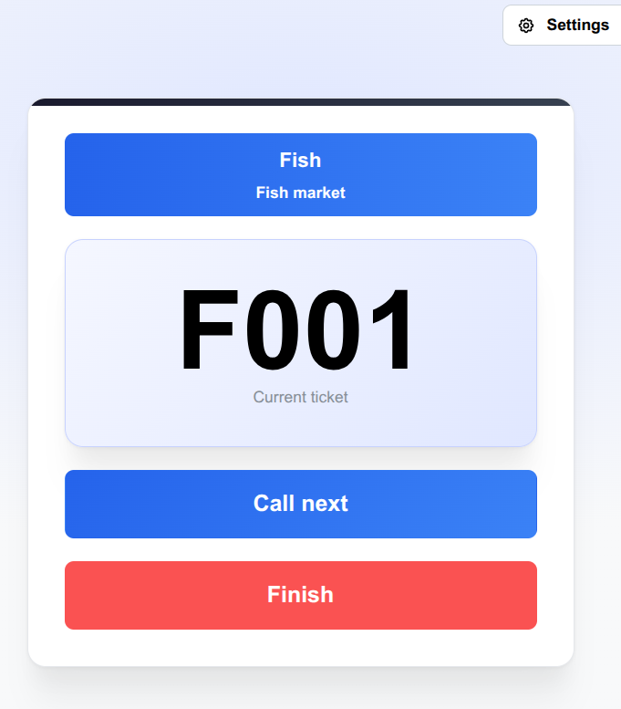
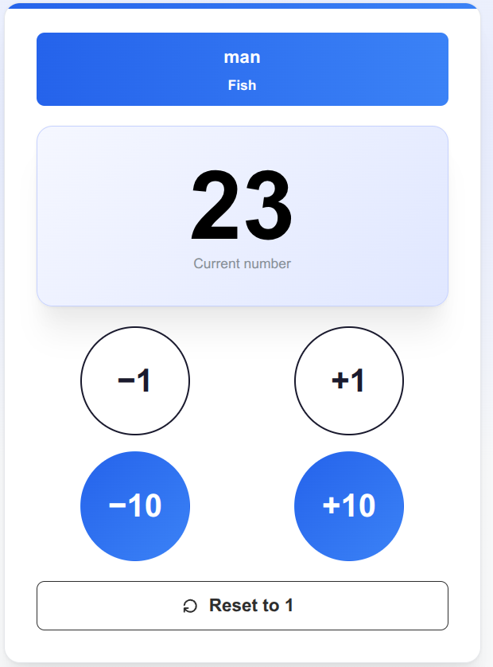
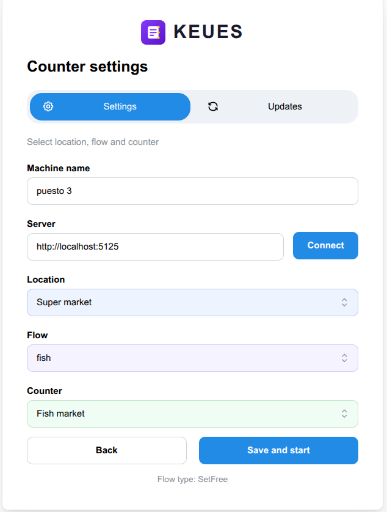

# Keues Counter

[](https://github.com/HastaCs/Keues-Counter)
[](https://github.com/HastaCs/Keues)
[](LICENSE)

[Read this in English](README.md)

La app de **mostrador** (puesto de atención) para **Keues**, el sistema de gestión de colas. Web oficial y documentación: **[https://www.keues.dev](https://www.keues.dev)**.

Keues Counter se ejecuta en cada puesto atendido — carnicería, pescadería, verdulería… — para que el operador pueda **llamar al siguiente turno**, **finalizar una atención**, **marcar el puesto como libre** o hacer **llamadas de número manuales**. Es la contraparte de *acción* de las pantallas de monitor de solo lectura.

> ⚠️ Requiere el **[backend de Keues](https://github.com/HastaCs/Keues)** para funcionar. No funciona de forma aislada.

---

## Capturas de pantalla

| Máquina de tickets | Puesto libre |
|---|---|
|  |  |

| Llamada manual | Pantalla de configuración |
|---|---|
|  |  |

---

## Cómo funciona

1. Elige el **servidor**, una **ubicación**, un **flujo** y tu **puesto**, y dale un **nombre**.
2. Guarda: la app se conecta en tiempo real y muestra el panel que corresponde al tipo de flujo.

| Tipo de flujo | Panel | Qué hace el operador |
|---|---|---|
| TicketMachine | CallTicket | Llamar al siguiente turno / finalizar la atención |
| SetFree | SetFree | Marcar el puesto como libre |
| ManualCall | ManualCall | Número manual: +1 / −1 / +10 / −10 |

---

## Características

- **Llamar siguiente / finalizar**: atender turnos en orden y cerrar la atención.
- **Puesto libre**: avisar al sistema de que el puesto vuelve a estar disponible.
- **Llamadas manuales**: número local del puesto con +1 / −1 / +10 / −10 y reinicio.
- **Estado de conexión en tiempo real** y badge con el nombre del puesto.
- **Configuración persistida**: la configuración se recuerda entre arranques.

---

## Instalación

Requiere la [toolchain de Rust](https://rustup.rs/) y los prerequisitos de plataforma de Tauri (ver [tauri.app](https://tauri.app/start/prerequisites/)).

```bash
pnpm install
pnpm start
```

En el primer arranque se abre la pantalla de configuración (URL del servidor, ubicación, flujo y puesto). La configuración se guarda localmente, de modo que los siguientes arranques van directos al panel del puesto.

---

## Licencia

Publicado bajo la [licencia MIT](LICENSE).
